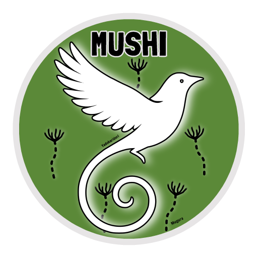

  

# 🪲 Mushi

Mushi is a simple and lightweight WhatsApp bot written in javascript using [Baileys](https://github.com/WhiskeySockets/Baileys) library.

> [!WARNING]
> This project is still in development and may not work as expected.

> [!IMPORTANT]
> Use Deno 2+, Bun 1.3+, NodeJS 23+

## Example `.env` configuration

You can copy `.env.example` to `.env` and fill in the required values.
`cp .env.example .env`
